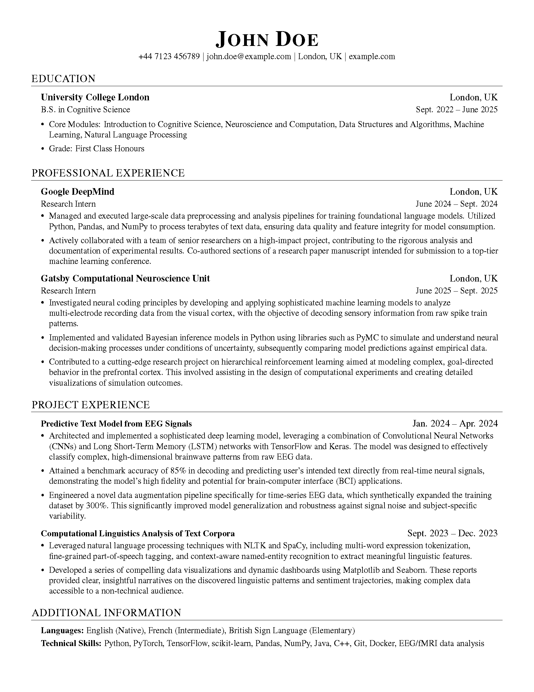

# Resume2LaTeX - Generate Formatted Resume in LaTeX

A python script that generate a formatted resume  info from structured JSON data to a formatted resume page in LaTeX format.



## Files

- `resume2latex.py` - Main Python script for resume generation and validation
- `resume_template.json` - Template JSON file for creating your resume data

## Usage

### 1. Create a new template JSON file to fill in

```bash
python3 resume2latex.py -t
# or
python3 resume2latex.py --template
```

This will generate a `resume_template.json` file with example data that you can edit.

### 2. Generate resume from your JSON file

```bash
python3 resume2latex.py resume.json
```

### 3. More options

```bash
# Show help
python3 resume2latex.py -h

# Validate the generated LaTeX file
python3 resume2latex.py resume.json -v

# Only check existing LaTeX file without generating new one
python3 resume2latex.py file.tex -c

# Specify custom output filename
python3 resume2latex.py resume.json -o my_resume.tex
```

## Auto-generated Filename

The script automatically generates output filenames based on the name in your JSON data:
- Input: `"John Doe"` → Output: `John-Doe_resume.tex`
- Input: `"Mary Jane Smith"` → Output: `Mary-Jane-Smith_resume.tex`

Spaces in names are automatically converted to hyphens for the filename.

## JSON Data Structure

The JSON file should contain the following structure:

```json
{
    "personal_info": {
        "name": "Your Full Name (e.g., John Doe)",
        "phone": "+44 7123 456789",
        "email": "your.email@example.com",
        "location": "City, Country",
        "website": "your-website.com"
    },
    "education": {
        "institution": "University Name (e.g., University College London)",
        "location": "City, Country",
        "degree": "Your Degree",
        "period": "Start Date -- End Date",
        "details": {
            "core_modules": [
                "Module 1",
                "Module 2",
                "Module 3",
                "Module 4",
                "Course Module 5 (or just leave blank)"
            ],
            "grade": "Your Grade"
        }
    },
    "professional_experience": [
        {
            "company": "Company Name",
            "location": "City, Country",
            "position": "Job Title",
            "period": "Start Date -- End Date",
            "description": [
                "Description 1",
                "Description 2",
                "Description 3"
            ]
        }
    ],
    "project_experience": [
        {
            "name": "Project Name",
            "period": "Start Date -- End Date",
            "description": [
                "Description 1",
                "Description 2",
                "Description 3"
            ]
        }
    ],
    "additional_information": {
        "languages": [
            {
                "language": "Language Name",
                "proficiency": "Proficiency Level"
            }
        ],
        "skills": [
            "Skill 1",
            "Skill 2",
            "Skill 3"
        ]
    }
}
```

## Template Usage

1. Run `python3 resume2latex.py -t` to generate the template
2. Edit `resume_template.json` with your information
3. Run `python3 resume2latex.py resume_template.json` to generate your resume
4. The generated LaTeX file can be compiled with any LaTeX compiler

## Features

- **Flexible Command-line Interface**: Supports multiple flag variations (`-t`, `--template`, `--t`, `-template`)
- **Auto-filename Generation**: Creates filenames based on your name
- **LaTeX Validation**: Built-in validation to check for syntax errors
- **Interactive Help**: User-friendly help system when no arguments are provided
- **Template Generation**: Creates ready-to-use JSON templates with examples

## Error Handling

If you run the script without arguments, it will display:
```
ERROR: Either a Input JSON file or a specified command flag is required.
Usage: python3 resume2latex.py <json_file> [options]

Need help? (y/n)
```

Responding with 'y' will show detailed help information. 

## Notes

```mermaid
flowchart TB
    %% Actors
    User(["User / Developer"]):::actor

    %% Script Modules Subgraph
    subgraph "Resume2LaTeX Script"
        direction TB
        CLIParser["CLI Parser"]:::internal
        TemplateGen["Template Generator"]:::internal
        JSONParser["JSON Parser / Validator"]:::internal
        Formatter["LaTeX Formatter"]:::internal
        FilenameGen["Filename Generator"]:::internal
        Validator["LaTeX Syntax Validator"]:::internal
    end

    %% File System Data Stores
    subgraph "File System"
        direction TB
        TemplateFile[("resume_template.json")]:::datastore
        InputExample[("sample.json")]:::datastore
        OutputExample[("sample.tex")]:::datastore
        README[("README.md")]:::datastore
        LICENSE[("LICENSE")]:::datastore
    end

    %% External Dependency
    ExternalCompiler(["LaTeX Compiler"]):::external

    %% Flows
    User --> CLIParser
    CLIParser -->|"--template"| TemplateGen
    TemplateGen --> TemplateFile
    TemplateGen -->|"console output"| User

    CLIParser -->|".json input"| JSONParser
    JSONParser --> Formatter
    Formatter --> FilenameGen
    FilenameGen --> OutputExample
    FilenameGen -->|"console output"| User
    FilenameGen --> Validator
    Validator --> ExternalCompiler
    ExternalCompiler --> Validator
    Validator -->|"validation status"| User

    CLIParser -->|"--check .tex"| Validator

    %% Example files as optional input/output
    User --> InputExample
    User --> OutputExample

    %% Styles
    classDef actor fill:#f9f,stroke:#333,stroke-width:2px,shape:ellipse
    classDef internal fill:#bbf,stroke:#333,stroke-width:1px
    classDef datastore fill:#bfb,stroke:#333,stroke-width:1px,shape:cylinder
    classDef external fill:#ffb,stroke:#333,stroke-width:1px,shape:hexagon
```

- The script automatically escapes LaTeX special characters (`{`, `}`, `&`, `%`)
- All output messages are in plain text (no emojis)
- The generated LaTeX file follows a clean, professional format
- Template includes detailed examples to guide users
